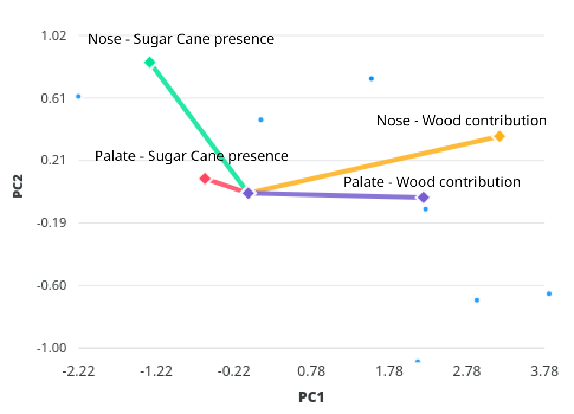
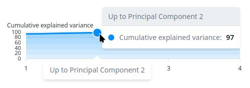

# How to read the charts

!!! tools "Work in progress"
    This site is still under construction. Please come back later for further
    information and documentation.

## Principal Component Analysis

### Theoretical introduction
This section is for information only and may be disregarded. For an
interpretation of the graphs, see [Interpretation of PCA](#interpretation-of-pca)
#### General concept and goal of PCA

In exploratory data analysis and visualization, a Principal Components Analysis
is a method of summarizing the data to reduce the number of features
(variables), often referred to as the dimensionality of a data set, in order to
ease its visualisation and interpretation.

In practice, we aim at defining a new set of _features_ (called the principal
components), built as linear composition of the original features, and which
describe as much as possible of the variance, or variation, within the dataset.
This in turn will **help understand which features are redundant, related to
each other, if they are positively or negatively related, or how well they
differentiate between each point of the dataset**.

Of course the goal is to have a number of principal components smaller set than
the original one variables. These new variables summarize the data, each one
comprising a proportion of the original features of the dataset. The higher the
proportion, the more weight the original variable holds in explaining the
variation.

!!! example "Choosing the features"
    Let's imagine we are trying to describe a number of wines. We could
    theoretically use any "feature" to characterize them: color, alcohol content,
    region, producer... But characterizing them should allow us to differentiate
    them. The temperature for example, doesn't seem to be any relevant in our
    characterization of the wine, if they are all at room temperature: only knowing
    the temperature of the wine is not enough for us to identify them.

    When performing a sensory analysis, we choose a set of criteria we hope will
    allow us to best differentiate the samples between them, and if not, will prove
    the samples are very similar.

    Applying a PCA is a way to understand if these criteria are indeed relevant to
    differentiate the wines.

The principal components are sorted by order of importance: the first principal
components is the one explaining the biggest part of the variation among the
dataset, the second principal component explains the second highest variation,
and so on. The charts are obtained by plotting principal components against each
other (_PC1_ VS _PC2_, _PC1_ VS _PC3_, _PC2_ VS _PC3_, etc), each dot
representing the contribution of one feature (tasting criteria or taster) to the
considered principal components.

#### Applying PCA to descriptive sensory analysis: defining features

Applying the dimensionality reduction of a PCA to descriptive sensory analysis
is not as straightforward as it could seem at first. Conceptually, the results
are described by two sets of features: the sensory criteria on one side, and the
assessors themselves on the other side. Both should be looked at in parallel,
albeit expecting opposites results for each case:

1. When applying a PCA with the sensory criteria as features (usually then only
   keeping the consensus averaged scores), we want to have criteria which are as
   independent from one another as possible; in other words, we want each of the
   criteria to have the strongest contribution possible to the variance in the
   dataset; the opposite would mean that said criteria does not allow to
   differentiate properly between samples.
2. On the other hand, when applying a PCA with the assessors as features
   (usually then only keeping the total score of each sample), the results
reflect the agreement between the tasters. Considering two assessors A and B, if
they completely agree on a set of samples, i.e. if both of them give the same
score to each individual sample, we are not able to tell which results are from
taster A and which are from taster B. The opposite is also true, if they are
strongly disagreeing, looking at a single set of scores will allow us to
identify the taster.

The dashboards are therefore displaying the results of two PCA: one using the
tasting criteria as features, using the scores of each sample averaged on the
whole panel, and a second one using the tasters as features, using the total
scores given be each taster for every sample.

### Interpretation of PCA
#### Goals of the PCA

Applying a Principal Component Analysis to sensory evaluation can be
particularly helpful to interpret and understand the results, whether it is to
compare products, assessors, or both. It aims at finding patterns and
relationships in the data, between tasting criteria and between tasters.

It can therefore, on one side, show how tasting criteria are related (for
example, it might proves that two sensory characteristics are closely related, evolving
concurrently, or on the contrary, negatively correlated, the increase of one
leading to the decrease of the other). It can also proves the relevance of a
sensory criteria, i.e. if a given criteria allows to differentiate between
samples or is actually rather meaningless.

!!! tip "Example PCA on tasting criteria"

    Consider the following example: a sample of rum has been stored in wood
    barrels for 2 years, and monthly tasted by the same group of experts. The
    goal was to evaluate the evolution of the primary aromas versus tertiary aromas.
    Four tasting criteria were rated: 

    - Sugar can presence in the nose
    - Wood contribution in the nose
    - Sugar cane presence on palate
    - Wood contribution on palate

    For the sake of illustration, let's considered that the experts agreed every
    time. The scores are averaged over the whole panel for each criteria and every
    tasting date. We therefore obtain a dataset of 24 lines (one per tasting date)
    and 4 columns (one per criteria), on which is performed a PCA. The results
    are given below, with PC1 represented in the _x_-axis and PC2 on _y_-axis.

    <figure markdown="span">
        { loading=lazy, width="60%" }
        <figcaption>Illustration of a PCA on tasting criteria for a
        sample of rum during maturation</figcaption>
    </figure>

    From the chart, we can conclude that:

    - Sugar cane presence and wood contribution are negatively correlated, as the
    wood parts are situated on the positive side of PC1, while sugar cane presence
    is on its negative side. While the wood contribution gets stronger, the sugar
    cane presence tends to decrease, albeit more slowly as their absolut values are
    smaller along PC1;
    - The wood contributions on nose and palate are very similar, although it
    seems to be stronger in nose than on palate;
    - Finally, the sugar cane presence on palate, given its very small value,
    has very little impact on the overall evaluation: it is in that case not
    evolving much over time, has it would hardly be enough to distinguish
    between the dates of tasting.

On the other side, a PCA is useful to find patterns between groups of tasters,
as a measure of their agreement. Tasters with similar opinions will be close to
each others on the charts, with a positive correlation, while disagreeing assessors will
display a negative correlation, being opposed on the charts. Similarly, an
assessor who provides very similar evaluation from one sample to the other, in
other words who is not really able to differentiate between sample, will display
a very small contribution to the principal components.

#### Explained variance

As all principal components are uncorrelated, each explains a proportion of the
variation measured in the dataset, with PC1 explaining the highest variation,
PC2 the second highest variation, and so on. The proportion of variation is
known as the _explained variance_, and expressed as a percentage. It can be
understood as an indication on how important a principal component is in
explaining the variation of data.

The cumulative explained variance is drawn on top of the PCA charts, as an
indication on how much of the variation of the data is captured by the
components represented. The cumulative explained variance corresponding to the
above chart is given below.

<figure markdown="span">
    { loading=lazy, width="80%" }
    <figcaption>Plot of the cumulative explained variance; the first two
        components explain 97% of the variation of the data</figcaption>
</figure>

It is important to keep in mind the value of the explained variance when analyzing the
PCA plots: how much of the variation is captured is an indication of how
relevant the component is for further interpretation. In the example above, the
first component already explains 93% of the variation, while the second only
explains 4% (cumulative explained variance of 93 + 4 = 97%). It is then evident
that the contribution of the second component is insignificant compared to the
first one; when reading the PCA charts, the differences or correlations along the
_x_-axis (PC1) should be given much more attention than those along the _y_-axis
(PC2).

#### General rules for interpretation

As a general rule of thumb, the relevance of a _feature_ is given by how far
away from the origin it lies: characteristics which do not allow to
differentiate samples will fall close to the origin, while characteristics with
values close to one are good descriptors of the products. Two concentric circles
are drawn on the charts: _features_ falling between the two circles can be
safely considered relevant (and the closer to the external circle the better),
while _features_ found within the smaller inside circle are most probably not
very important, either because the panelists disagree strongly, or because they
don't allow for a clear distinction between the products.

!!! warning "Take into account the explained variance"
    Pay attention to the explained variance of the components: **the higher the
    component's explained variance, the higher the contribution of the feature
    to the differences between samples**. As the components' explained variance
    decreases with the number of components (the first component explaining the
    biggest variation, second one explaining the second biggest and so on), the
    _x_-axis usually matters more than the _y_-axis.

_Features_ or characteristics which are similar to
each other will appear close to each other on the plots; characteristics which
are opposed will appear on opposite sides of the origin.

- Sensory characteristics (the tasting criteria used to evaluate the samples)
which are related, or evolving concurrently (i.e. an increase in one leading
to an increase in the other and vice versa) will lie close to each other on the
charts;
- In contrast, characteristics which are opposed (i.e. an increase in one will
lead to a decrease of the other and vice versa) will appear on opposite sides of
the origin.

The same conclusion can be drawn when looking at the assessors:

- Two assessors which are strongly agreeing will appear close to each other on
the chart; they share the same opinion and give similar scores to the samples;
- On the contrary, two panelists strongly disagreeing will be displayed on
opposite sides of the origin axis.

On more general terms, panelists agreeing will appear grouped together.

#### Example

The following charts illustrates the above concepts. The points from A to E
represent 5 different _features_: they can be seen as panelists or sensory
characteristics of the products.

<figure markdown="span">
    { loading=lazy, width="60%" }
    <figcaption>Example of a plot obtained from applying PCA on sensory data. The points from A to E represent the _features_</figcaption>
</figure>

What conclusions can be drawn from the chart.

**Features A and B are strongly relevant and correlated**

: _They are very close to each other, and both comprised between the two circles,
with a high x value (along PC1)._

If the considered features are sensory characteristics, they allow to
differentiate between samples quite well and therefore of quite high importance
for further analysis. There are also two aspects to consider:

1. First, the two characteristics are evolving concurrently: an increase
   (respectively a decrease) of the sensory characteristic A always drive an
increase (respectively a decrease) of the characteristic B, and vice versa. They
are therefore strongly linked according to the panelists.
2. However, fundamentally, both these attributes **might** actually measure the
   same characteristic!

If the considered features are actually the panelists, A and B share very
similar opinions, and are able to clearly differentiate between samples

**Feature C is also strongly relevant, but opposed to A and B**

: _C also shows a high x value (along PC1), but negative. A, B and C are close
to a straight line through the origin, with C on opposite side of A and B._

If the considered features are sensory characteristics, C is also an attribute
that allows to differentiate samples. However, it evolves in opposite direction 
than A and B: an increase in the feature C will lead to a decrease to both A and
B and vice versa.

If the considered features are panelists, there again C is a panelist which can
clearly differentiate between samples. However, it shows opinions strongly
opposed to panelists A and B. Special attention should then be given to
understand where the differences might come from: trainings, sensitivities,
social background...

**Feature D might or might not be relevant depending on the explained variance of PC2, and is independent from A, B and C**

: *D shows a very low x value (along PC1, the strongest in terms of explained
variance), but a very high y value along PC2*

In this case, it is important to have a look at the proportion of explained
variance of PC2. Should that value be very low, the feature D is rather
irrelevant. If a significant part of the variation is explained by PC2 however,
the feature D is relevant, although less than A, B and C (as the explained
variance of PC1 is always higher than the explained variance of PC2).

If the explained variance on PC2 is significant, feature D is considered
relevant. It shows very little relation to A, B and C, as D contributes almost
exclusively to PC2 (very low value along the _x_ axis but high value along the
_y_ axis), while A, B and C contribute almost exclusively to PC1.

In other words, if the features are sensory characteristics, D allows for a
clear differentiation between products but is independent of features A, B and
C. If the features are panelists, D shows a third opinion and different
sensitivities than panelists A, B and C. They are neither agreeing nor
disagreeing with either A and B or C.

**Feature E is the less relevant**

: _E shows a very low contribution to both PC1 and PC2 as it falls close to the
origin of the chart and is within to inner circle_

If the features are sensory characteristics, the feature E doesn't really allow
to differentiate between products, or reflects a disagreement between panelists.
It _should_ be discarded for further analysis. Special attention should be given
to that criteria in future tastings: maybe it is misunderstood by the assessors,
or simply not relevant to the considered category of products.

If the features are panelist, assessor E doesn't seem to be able to clearly
differentiate products, and their evaluation does not really influence the
overall results. This could come from an improper use of the scales (the
panelist might give very similar scores to all products), or a lack of training.
