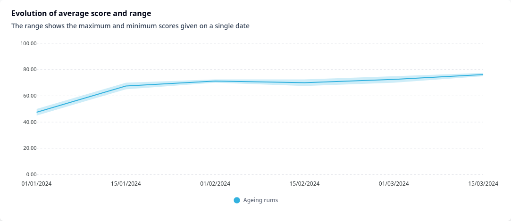
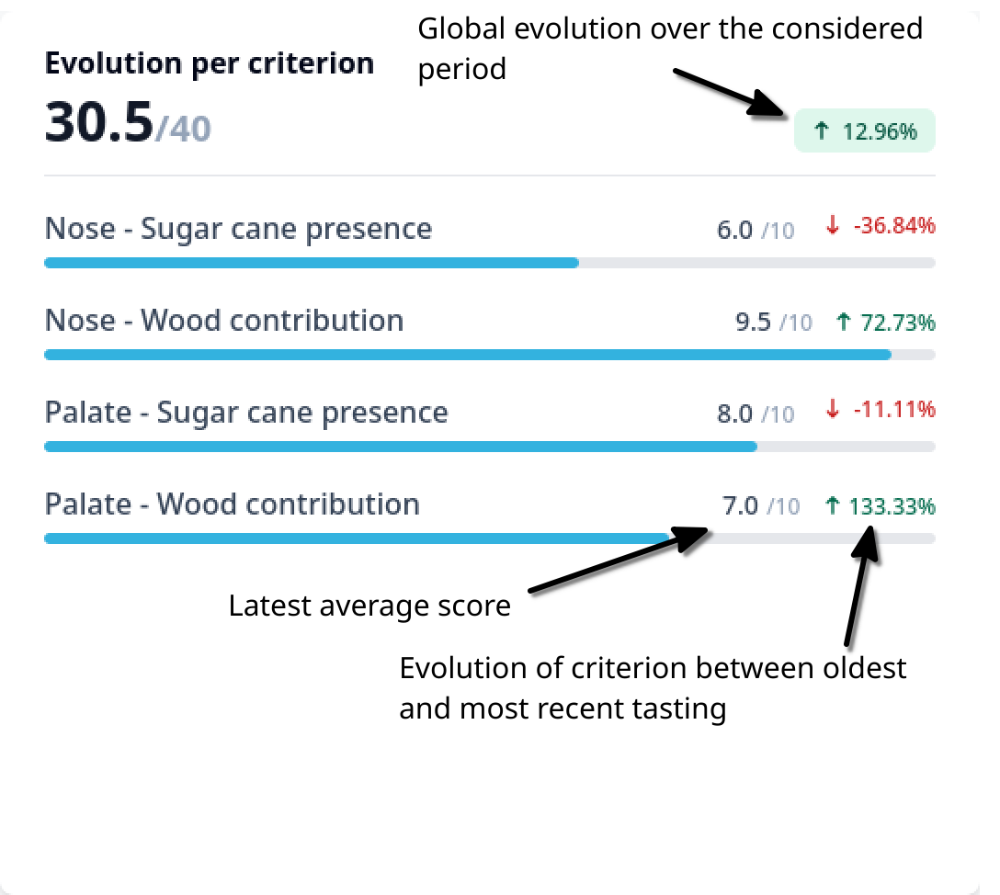
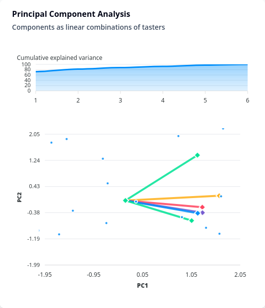
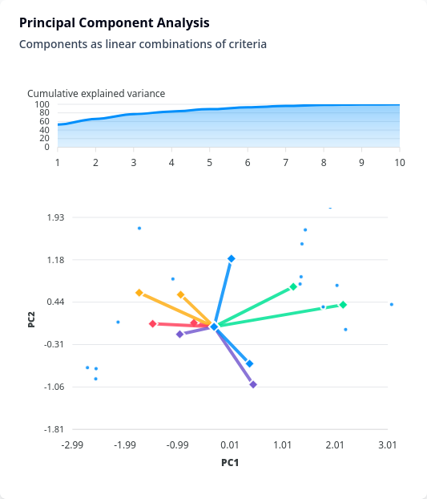

# Individual product dashboard

!!! tools "Work in progress"
    This site is still under construction. Please come back later for further
    information and documentation.

The product dashboards are available as soon as a product has been evaluated.
They will also automatically update to include the most recent results.

## Accessing a dashboard

To access a product dashboard, go to `Dashboards` in the left side bar or from
the top right menu :material-view-grid:. Navigate to the **PRODUCT DASHBOARDS**
section, and click `View results` in the table next to the product you are
interested in. You can also directly search for a specific product in the search
bar at the top of the table.

<figure markdown="span">
{ loading=lazy }
{ loading=lazy }
</figure>

!!! tip "Dashboards should be displayed on a big enough screen"
    Although dashboards can be accessed from a mobile device such as a smartphone,
    there must be enough screen space needs to view the charts. We strongly recommend
    that you view the dashboards on a desktop or tablet screen, as a smartphone
    tends to cut off the charts, making them difficult to read and interact with.

## Overview
Product dashboards aims at displaying qualities and flaws of a given product.
They can also be used to visualize the evolution of its sensory profile with
time (for example [during maturation](use-cases.md#finding-the-optimal-maturation-time-of-a-spirit)).

The data can be filtered based on tasting dates and assessors. In the **Apply
filters** section at the top of the dashboards, you can include/exclude
assessors from the results, as well as select only a given period. Click on
**Apply** to update the charts.

!!! warning "Different tasting grids"
    It is possible that over time, different tasting grids will be used to evaluate
    the same sample. In that case, the results of each tasting grid will be
    displayed separately. The name of the corresponding tasting grid is shown above
    the charts.

-   :material-clock-fast:{ .lg .middle } __TL;DR__

    ---

    The first chart on the page includes all the tasting grid found in the
    results if there were multiple. 

    - **Scores per criterion** (_if the product was only tasted once_) shows the
    scores per criteria given by each single taster;
    - **Evolution of average score and range** (_if the product was tasted more
    than once over time_) shows the average total score of the product, as well as the
    range of scores among the assessors (lowest and highest total score);

    The following charts are related to a single tasting grid; the name of the
    tasting grid will be displayed above the charts.

    - **Evolution per criterion** displays the average score for each criterion
    of the tasting grid. If the product was tasted multiple times, the score
    progression between the oldest and most recent tastings will be specified;
    - **Scores per criterion** shows the averaged score for each criterion of
    the grid on a so called radar or spider chart for easier interpretation;
    - **Tasting notes treemap** shows the frequency of words found in the
    tasting notes corpus. 
    - **Principal Components Analysis with components as linear combinations of
    tasters** displays the loading plots of a Principal Components Analysis on
    the total average scores given by each taster, and aims at showing
    agreements and disagreements between tasters;
    - **Principal Components Analysis with components as linear combinations of
    tasting criteria** displays the loading plots of a Principal Components Analysis on
    the total average scores for each criteria, and aims at showing patterns and
    relations between sensory characteristics;

!!! tip "The charts are interactive"
    The charts can be interacted with in a number of ways. The interactions
    depend on the chart type but in general you can:

    - Hover over the chart to see more details about the numbers;
    - Click and Drag to zoom in on a specific area of the graph; scroll down to
    zoom out;
    - Clicking on the legend activates/deactivates that part of the graph.

## Charts details
### Scores per criterion

The scores per criterion charts is displayed only if the product has been
evaluated on one single instance (independently of the number of assessors),
i.e. if the database contains results only for one single date.

<figure markdown="span">
{ loading=lazy, width="75%" }
</figure>

It displays the scores given by each assessor for every criteria as columns, as
well as the corresponding average score as line. **Note that the scores are
normalized to 10 for ease of comparison**: even if the available minimum
and maximum scores of a given criterion were different on the tasting grid, they
are all displayed as from 0 to 10 on the chart.

!!! example "What to look for"
    This is a first quick glance at the strength and weaknesses of the product.
    It also already gives an idea on the sensitivities of assessors and how they
    agree or disagree.

### Evolution of average score and range

This chart shows the evolution of the average, maximum and minimum scores given
over time by assessor. In case different tasting grids have been used, each line
represents a given protocol. The solid colour line is the average, while the
lighter colour area represents the maximum and minimum scores given at each
specific date.

<figure markdown="span">
{ loading=lazy, width="75%" }
</figure>

**Note that the scores are expressed as a percentage of the
maximum possible score of the considered tasting grid.** As multiple tasting
grids can have been used over time, and considering that two tasting grids can
have completely different scales (e.g. one grid allowing scores from 0 to 50
while the other allows scores from 0 to 120), to allow for a meaningful
comparison, they are all normalized to the same scale of 0 to 100.

!!! example "What to look for"
    Considering that a sensory analysis is a measure of liking and disliking,
    the evolution chart can help determine the optimum sensory profile of a given
    product, or reveal when a change in the product brings improvement or
    deterioration of the profile. The area around the line can also help identify
    whenever a group of assessor concur (translated as a narrow area around the
    line), or on the contrary when the product divides the assessor (translated as a
    wide area around the line).

### Evolution per criterion

The aim of the evolution per criterion is to provide details on how each sensory
criterion is evolving over time; it gives the total average score as well as the
average score per criterion on the most recent date considered, and the
evolution since the oldest date considered.

<figure markdown="span">
{ loading=lazy, width="55%" }
</figure>

The scores are displayed without normalization, i.e. as per the tasting
criterion scale. Note that the displayed values depend on the selected period in
the date range filter.

!!! example "What to look for"
    Using the [global evolution of average score and range above](#evolution-of-average-score-and-range),
    the chart can provide more details and explain which criteria are
    responsible for any increase or decrease in the total score. Use the date
    range filter around a spike on the previous chart to highlight and
    understand precisely how the sensory profile is evolving.

### Scores per criterion and evolution over the selected period

Similarly to the previous graph, the radar chart shows the average score per
criteria of the tasting grid and its evolution at a glance; the blue web gives
the scores at the oldest date, while the red web gives the scores at the most
recent tasting date. **Note that the scores here are normalized on a scale from
1 to 10 for easier comparison between criteria**: even if a sensory
characteristic is evaluated on a different scale on the tasting
grid, its score here will be shown between 0 and 10. As such the radar chart
does not take into account the weight given to each criteria on the tasting
grid. 

!!! example "What to look for"
    You can quickly see which were the criteria which have displayed the highest
    changes over the considered period, as well as find out what are the qualities
    and flaws of a product.

### Wordcloud

The word cloud graph is a treemap of the words found in the corpus of tasting
notes (all tasters included); it shows the relative frequency or importance of 
the different vocables within the corpus.

<figure markdown="span">
{ loading=lazy, width="75%" }
</figure>

Depending on the tasting protocol, different colours refer either to different
categories of criteria (e.g. Nose, Palate, General, etc.) or to different
criteria (e.g. Expressiveness in the nose, Flavour complexity on palate, etc.). A
single colour indicates general tasting notes which are not related to a
specific criterion.

!!! info "Removed words"
    The text corpus is first trimmed of some of the most common words (such as
    "the", "and", "this", etc) that are not expected to provide any meaningful
    information.

!!! tip "Date range"
    The wordcloud takes into account **all the tasting notes** over the selected
    period. If the sensory profile has evolved a lot over the considered period, it
    might be a good idea to select a single date in the date range filter to analyse
    the words, as the comments have most probably changed as well.

### Principal component analysis

The principal component analysis (PCA) aims at reducing the number of variable
in the dataset in order to find patterns and relationships in the data. Applied
to sensory evaluation, two sets of variables are considered: on one side, we are
looking at the sensory criteria as variables, considering then only the
consensus scores (i.e. the average scores among all the assessors), and on the
other side, we are looking at the assessors themselves as variables, considering
the total score they are each giving to a product.

The goal is then to highlight agreements between assessors or group of
assessors, and to find out how sensory criteria are linked to each others and
meaningful in the sensory evaluation as a whole.

More details can be found in the [PCA section of Reading the
charts](charts.md#principal-component-analysis).

!!! warning "Minimum amount of data required"
    Performing a PCA is only available if enough data has been collected. The
    charts will remain empty in such a case, displaying a message that not enough
    data is available. Keep in mind however that depending on the case
    considered, PCA can be calculated on either of the tasting criteria or
    assessors, both, or none.

    A sample that has been evaluated only once by multiple tasters will
    give information on their agreement but not on the relevance of the tasting
    criteria. A sample evaluated multiple times by one single taster will of course
    give information only on the relevance of the tasting criteria.

#### General considerations

Whether the PCA is performed on the tasters or on the sensory criteria, it is
capital to pay attention to the *explained variance*, represented by the area
chart at the top. 

<figure markdown="span">
    { loading=lazy, width="80%" }
    <figcaption>Plot of the cumulative explained variance; the first two
        components explain 97% of the variation of the data</figcaption>
</figure>

As the bottom chart plots the value of Principal Component 1 (PC1) on the _x_-axis
and Principal Component 2 (PC2) on the _y_-axis, the explained variance provides
information on the relative importance of both the components in explaining the
global variation among the data. The explained variance chart plots the cumulative 
explained variance of the components. Note that said importance is always
decreasing, i.e. the explained variance of PC1 is always greater than the
explained variance of PC2, which is always greater than the explained variance
of PC3, and so on. In other words, the greater the value at PC2, the more
reliable is the chart under it. For the same reason, the difference between the
explained variance of PC1 and PC2 provides information on the relative
importance of one to the other.

For example, in the illustrative graph above, PC1 and PC2 together explains 97%
of the variation within the dataset, which is a very good result. The
corresponding plots will be highly informative in finding patterns and relations
between the variables. However, PC1 on its own already explains 93% of the
variation. The differences along the _x_-axis (horizontally) will then be much more important
in understanding the variation than the differences along the _y_-axis
(vertically). If PC1 was only explaining 50% of the variation, with PC2
explaining the remaining 47%, both should be looked at with equal care.

#### PCA on tasters

The first PCA performed provides information on the agreement between tasters
and indications on how distinct the sample has seemed to each of them every time 
it has been evaluated.

<figure markdown="span">
    { loading=lazy, width="70%" }
    <figcaption>PCA performed on assessors as features. Each of the points are
        representative of one of the tasters, who overall show a relatively good agreement</figcaption>
</figure>

!!! example "What to look for"
    There are 4 cases to consider:
    
    1. Tasters in good agreement will be close to each others. You
       therefore might be able to find patterns between group of tasters who seem to
       share the same opinion;
    2. Tasters with strong disagreement will lie on opposite side of a straight line
       through the origin of the chart. It would reveal that their overall
       opinion on the sample over time has been quite diverging, liking and
       disliking being reversed;
    3. Tasters who do not specially agree nor disagree will lie relatively far
       from each other, but not on opposite side of a straight line as above;
    4. Finally, tasters who give very similar opinions from one evaluation to
       the other and whose opinion do not really impact the variation between evaluations
       will fall close to the center. It could be due to a poor use of the
       scales in the tasting protocols, or because the sample shows very little
       variation to them.

#### PCA on tasting criteria

The second PCA aims at finding links between the evaluated sensory
characteristics and how relevant they are in differentiating between evaluations.

<figure markdown="span">
    { loading=lazy, width="70%" }
    <figcaption>PCA performed on sensory criteria as features. Each of the points are
        representative of one of the criteria of the tasting grid</figcaption>
</figure>

!!! example "What to look for"
    As for the PCA on tasters, there are 4 cases to consider:

    1. Criteria strongly positively correlated (i.e. which usually improve or recede concurrently)
       will be close to each other;
    2. Criteria strongly negatively correlated (i.e. an improvement in one will
       cause a decline in the other) will lie on opposite side of a straight
       line going through the origin of the chart.
    3. Criteria which do not show relation to each other will be relatively far
       to each other, but not opposed as above.
    4. Criteria which do not vary a lot between evaluations will lie close to
       the center (they might be discarded for further analysis)
    
