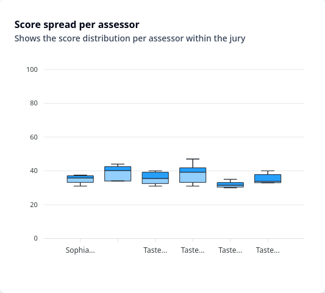

# Taster self-assessment

!!! tools "Work in progress"
    This site is still under construction. Please come back later for further
    information and documentation.

## Preamble: sensory evaluation is an opinion

The taster self-assessment dashboards are **individual and specific to the
logged-in user**. They focus on the user's own ratings **in relation to the
ratings of other tasters**. Only the user themselves can access their own
dashboards.

When evaluating a wine or a spirit, a taster gives his or her own opinion about
the product. When a panel of tasters evaluate the same product together, we want
to understand if there is a consensus in the opinions of a group of people,
either a general consensus or multiple opinions that could be sorted based on
sociological, cultural or professional backgrounds.

In order to highlight the consensus, if there is one, the [differences between
the tasters](index.md#expected-differences-between-tasters) need to be reduced
as much as possible, so that the results themselves can be trusted. Although the
data can be processed to a certain extent to reduce these differences, the
tasters themselves need to be aware of their evaluation style **in relation to
other tasters** so that they can adapt and improve.

This is the purpose of the self-assessment dashboards: to show a taster whether
his or her ratings and use of the tools are similar enough to those of other
tasters, and he or she shares the same opinion as others.

## Accessing a dashboard
Taster self-assessment dashboards are linked to tasting sessions. Once all
assigned tasters have completed the tasting (or once the
delay for completion has elapsed), the results dashboards can be accessed by clicking
on `Dashboards` in the left sidebar or in the top right menu
:material-view-grid:. Navigate to the **TASTING SESSION DASHBOARDS** section,
and click `View results` in the table next to the relevant session.

!!! info "Complete, Unfinished, In Progress"
    You will notice a badge inside the table with either a green _Complete_, or
    red _Unfinished_. These badges indicates the status of the tasting session:

    - _Complete_ indicates all tasters have complete the tasting sessions. **You can
    view all the results**;
    - _Unfinished_ indicates that the timeframe during which the tasting session
    was made available has passed, but not all assigned tasters have completed
    it. **You can view the results but they will be incomplete**;

<figure markdown="span">
{ loading=lazy }
{ loading=lazy }
</figure>

!!! tip "Dashboards should be displayed on a big enough screen"
    Although dashboards can be accessed from a mobile device such as a smartphone,
    there must be enough screen space needs to view the charts. We strongly recommend
    that you view the dashboards on a desktop or tablet screen, as a smartphone
    tends to cut off the charts, making them difficult to read and interact
    with.

## Dashboard overview
Your self-assessment dashboard is designed to compare your results with the
panel consensus, i.e. the average of the panel. It therefore shows the **raw
data**, or data with very little _pre-processing_.

Each graph should provide some information about your scoring style and
preferences, but it is important to look at all the graphs at once before
jumping to conclusions: usually the information provided by one graph will help
you understand the next, either confirming or nuancing the results of each
individual graph.

It is therefore highly recommended that you read the following sections
carefully, in order to understand the purpose of each chart and to see the
bigger picture.

-   :material-clock-fast:{ .lg .middle } __TL;DR__

    ---

    In order of appearance:

    - **Sample ranking** shows the ranking and average scores of the samples from best to worst
    according to the consensus (in green) compared to your own score (in pink) for
    each sample;
    - **Score delta** shows the difference between the consensus score
    (panel average) and your score for each sample in order of tasting;
    - **Score spread per assessor** shows the score spread and quartiles
    for each judge over the tasting session (your results first on the left);
    - **Agreement** gives a visual representation of the overall
    agreement of the panel, independent of the absolute scores (based on ranking only);
    - **Score spread per sample** shows the distribution of scores per sample
    across the panel;
    - **Tasting notes treemap** shows the frequency of words found in the
    tasting notes corpus. 

!!! tip "The charts are interactive"
    The charts can be interacted with in a number of ways. The interactions
    depend on the chart type but in general you can:

    - Hover over the chart to see more details about the numbers;
    - Click and Drag to zoom in on a specific area of the graph; scroll down to
    zoom out;
    - Clicking on the legend activates/deactivates that part of the graph.

### Sample ranking

The sample ranking shows the average scores of all the samples of the flights,
ranked from higher (top) to lower (bottom) score, in comparison to your own scores.

<figure markdown="span">
{ loading=lazy, width="75%" }
</figure>

!!! example "What to look for"
    This is a first overview of your results for the session; you should already
    be able to see if you are following the same trends as the consensus, with
    similar rankings.

    Level and scaling differences should also be apparent: if your scores are **consistently**
    fairly higher or lower than the consensus average, your may want to adjust your scoring to be harsher
    or conversely more generous. If you notice that the differences
    between your scores and the consensus scores seem to be higher for the higher or lower
    points, there may be a large scaling difference between you and the rest of the
    panel.

### Scores delta

The score delta chart plots the difference &Delta;_score_ between a taster's score
and the consensus score (calculated as the mean of all taster
scores) for each sample in the flight, in order of service from left to right.

<figure markdown="span">
{ loading=lazy, width="65%" }
</figure>

For example, if you scored the first product of the flight at 88, while the
the panel average was 80, then the first point on the left of the graph will
be at _y=8_ on the vertical axis. A point aligned with the consensus line at
_y=0_ would correspond to an equality between your score and that of the panel,
while a negative value would indicate a score below the panel average.

The aim is to highlight a possible **[difference in
level](index.md#level-discrepancy)** between you and the jury.

!!! example "What to look for"
    The points should be distributed relatively evenly around the horizontal black
    dashed line at _y=0_. If you find that you are systematically above
    (or below) the black dashed line, you have been more generous
    (or harsher) in your scoring than the rest of your jury and you should
    adjust your use of the scale (on the _level_).

    You **should not punctually stray away** too far from the black dash line:
    this would indicate a disagreement with the rest of the panel for the sample in
    question. However, it is not necessarily a bad thing if most of your scores are
    far away from 0 and relatively evenly distributed. It would mean that your
    scoring range was wider than the rest of your panel, which is usually a good
    thing (see [scores spread per assessor
    below](self-assessment-dashboard.md#scores-spread-per-assessor))

### Scores spread per assessor

The score spread per taser is a box plot of the scores of each tasters on the
panel. Your own scores are displayed first on the left. Each one of the box plot
shows the distribution of scores for each assessor: the _whiskers_ extending
from the box represent the maximum and minimum scores, the coloured box is where
the middle 50% of the scores lie (all scores between the 25th and 75th percentiles),
and the line between the two shades of blue within the box is the median
score.

<figure markdown="span">
{ loading=lazy, width="75%" }
</figure>

It allows an easy comparison between judges' scoring patterns and a
visual representation of their confidence:

1. First, like the [Scores delta
   chart](self-assessment-dashboard.md#scores-delta), it gives a quick visual
indication of the **[level difference](index.md#level-discrepancy)** within the
panel;
2. Secondly, it shows the **[scaling difference](index.md#scaling-difference)**
   within the panel and can be understood as a representation of a judge's
confidence: the wider the plot, the more the judge is able to discriminate
products on the basis of their quality (e.g. a mediocre product will receive a low
score of 40 out of 100, while an excellent one will receive a score of 98). A
more ``shy" taster will show a narrower box-and-whisker plot.

!!! example "What to look for"
    You should aim for as large the box-and-whisker as possible. Unless, of
    course, all the samples evaluated are really of the same quality, a clear
    distinction between them is much more helpful for further analysis (especially
    when assessing the [panel agreement](self-assessment-dashboard.md#agreement)).

    Also check for possible additional information about your level difference. You
    may find that it is _"localised"_: if your median (the separation between the
    two shades of blue) is quite in line with the rest of the panel, but your box
    spread is much higher (or lower) than the rest of the panel, this indicates that
    you are much more generous (or harsher) with good (or bad) products, but aligned
    with the consensus on average and bad (or good).

### Agreement

The agreement chart, sometimes also called an _egg plot_, is designed to give a
visual indication of how similar the judges' **sample rankings** are within the
panel. It does not take into account the scoring itself, so it is independent of
any [level discrepancy](index.md#level-discrepancy). However, it is strongly
dependent on the [scaling](index.md#scaling-difference) of all the judges: if
they each individually gave very similar scores to each sample of the flight
(which would result in very small [box-and-whiskers plots as explained
above](self-assessment-dashboard.md#scores-spread-per-assessor)), the resulting
plot may give very little information at all.

<figure markdown="span">
{ loading=lazy, width="75%" }
</figure>

!!! info "Don't pay attention to the y-axis values"
    The _x-axis_ can be understood as the ranking of the products from left to
    right, with the first sample on the left being the one with the lowest average score, and the
    last one on the right being the one with the highest score, calculated as the
    panel average.

    However, the values on the _y-axis_ are meaningless: they are
    merely a mathematical transformation of the comparison between the ranking of the
    samples according to the consensus and according to each individual taster.
    The number of samples, of judges, or the differences themselves can give
    completely different values.

    In other words, **focus on the shape of the lines, not the values**.

The baseline in black represents the consensus ranking, and the ideal
situation where there is a perfect agreement between all tasters: if this were the
case, all coloured lines would be identical to the baseline. The coloured lines
represent each taster's "deviation" from the consensus ranking: the further
a coloured line is from the baseline, the greater the deviation between the
taster's ranking and the consensus.

!!! example "What to look for"
    First, consider these three cases:

    1. A panel in good agreement and able to clearly discriminate samples will see
    all the lines tending towards the black baseline and closely packed;
    2. A judge who often disagrees with the rest of the panel, while all are
    able to discriminate clearly, will see his or her line drifting away from the
    closely packed lines of the other judges. The other judges will stand close to
    the black base line;
    3. A panel who is lacking precision in their evaluation (i.e. is not able to
       discriminate clearly all the products) will see a relatively dense group
    of individual lines away from the baseline.

    If you see a graph that seems to fit in the third case, you should probably
    disregard it entirely, as it may not provide any useful information.

    Otherwise, compare your own line with the rest of the jury: how far are you from the
    baseline (the further away, the more you disagree with the rest of the jury),
    are you closer for the higher or lower ranks (showing good agreement for either
    the best or the worst samples of the flight), is another judge very close to
    your own line (showing good agreement between you, but not necessarily with
    the rest of the jury).
### Scores spread per sample

Similar to the [score spread per assessor](self-assessment-dashboard.md#scores-spread-per-assessor),
the score spread per sample is a box plot of the scores given to each sample in
the flight, in order of service. Each of the boxes shows the distribution of the
scores given to a sample by all judges in the panel.

<figure markdown="span">
{ loading=lazy, width="75%" }
</figure>

It provides an estimate of the [panel agreement](index.md#disagreement) per sample.
The larger the distribution of scores for a given sample, the larger the
differences in the scores and thus the panel disagreement. 

Note, however, that both level and scaling differences in the tasters' scoring
style can have a strong influence on this graph: a relatively large
but fairly similar score distribution between samples could be due to a large
level difference between the tasters; large scaling differences, in turn, could
result in some small boxes for the "average" products, with a larger distribution
for the higher/lower ranked products.

!!! example "What to look for"
    Keeping in mind the level and scaling differences as illustrated on the
    [score spread per taster chart](#scores-spread-per-assessor), compare the
    samples with the largest score distributions to your ranking and score delta: do 
    you find your largest disagreement with the panel consensus to be for samples 
    with a good agreement, or are they in fact the samples that failed to reach
    consensus within the panel?

### Wordcloud

The word cloud graph is a treemap of the words found in the corpus of tasting
notes (all tasters included); it shows the relative frequency or importance of 
the different vocables within the corpus.

<figure markdown="span">
{ loading=lazy, width="75%" }
</figure>

Depending on the tasting protocol, different colours refer either to different
categories of criteria (e.g. Nose, Palate, General, etc.) or to different
criteria (e.g. Expressiveness in the nose, Flavour complexity on palate, etc.). A
single colour indicates general tasting notes which are not related to a
specific criterion.

!!! info "Removed words"
    The text corpus is first trimmed of some of the most common words (such as
    "the", "and", "this", etc) that are not expected to provide any meaningful
    information.
