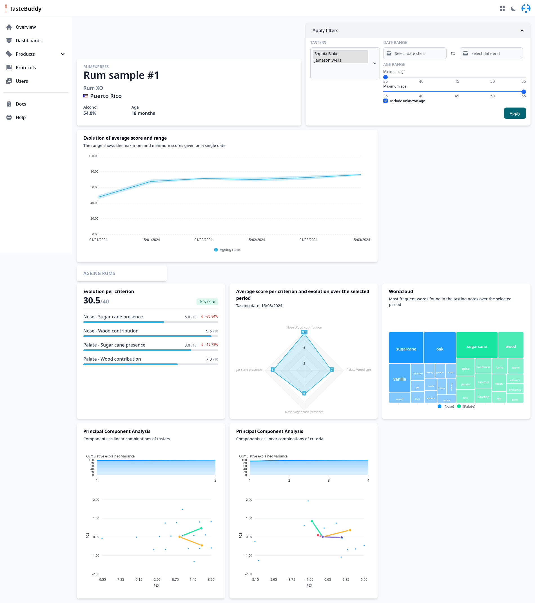

# Case study

The following are some examples of how to make the most out of Tastebuddy
depending on an organisation's needs. They aim at illustrating the differences
between **Punctual Tastings** and **Tasting Sessions**, and when to use which
protocol.

## Punctual tastings

### Finding the optimal maturation time of a spirit

A producer has recently barrelled his production with the aim of ageing it
indefinitely. They want to record the evolution of the aromatic profile and the
influence of the wood over time.
A tasting sheet is designed with two categories of criteria: on the one hand, the
expected characteristics of the aromatic profile of the un-aged eau-de-vie and, on
the other hand, the expected contribution of the wood.
The production team regularly takes samples from the casks and evaluates them
using the tasting sheet. The evolution over time of each criterion for each taster is
then displayed on a dashboard, showing in a user-friendly way the gains and losses
in the aromatic profile, and ultimately highlighting the optimal ageing period to
achieve the desired balance.

**Such a use case calls for a regular {==punctual tasting==} of the same sample to
showcase the evolution of the aromatic profile.**

The resulting dashboard for such a use case would display the evolution of the
aromatic profile over time. The example below shows the dashboard obtained for a
rum sample which has been tasted every other week by two people over a period of
three months.

{ loading=lazy }

### Evaluation of samples during a wine fair

A wine distributor is looking for new products to extend their portfolio.
They are present in an international fair, where they get the opportunity to
meet producers and taste their production.

Every product is evaluated carefully using a previously designed tasting
grid along the day. At the end of the fair, they are able to visualize their
impressions for each sample and highlight to products which could potentially
become new big sellers in their product range.

**Such a use case calls for multiple {==punctual tastings==} of previously
unknown products in order to be able to compare them.**

The resulting dashboard from such a use case would display a comparison between
the tasted products, with a ranking among them. It is therefor fairly similar to
a tasting session dashboard, although it does not take into account the
assessors differences since there is an unknown number of assessor for each
sample and most probably only one.

## Tasting sessions

### Assessement of ageing techniques

A company is developing three new ageing techniques and would like to know how
each of the three is perceived in relation to the others and to its usual technique.
Based on the same eau-de-vie (same distillation batch), three products have been
aged using the new technologies, while the fourth is the usual.

Small samples, marked only with a number, are sent to external consultants around
the world. When the samples are received, the consultant is given a link to a tasting
sheet designed to assess the specific aromatic criteria of the ageing process.
Once completed, the tasting results cannot be revised.

Once the consultant has carried out the analysis, the results are displayed on the
company's dashboard and can be manipulated: a consultant who strongly
disagrees with the panel can be excluded, specific criteria that show weaknesses
in the overall assessment can be highlighted, and so on.
